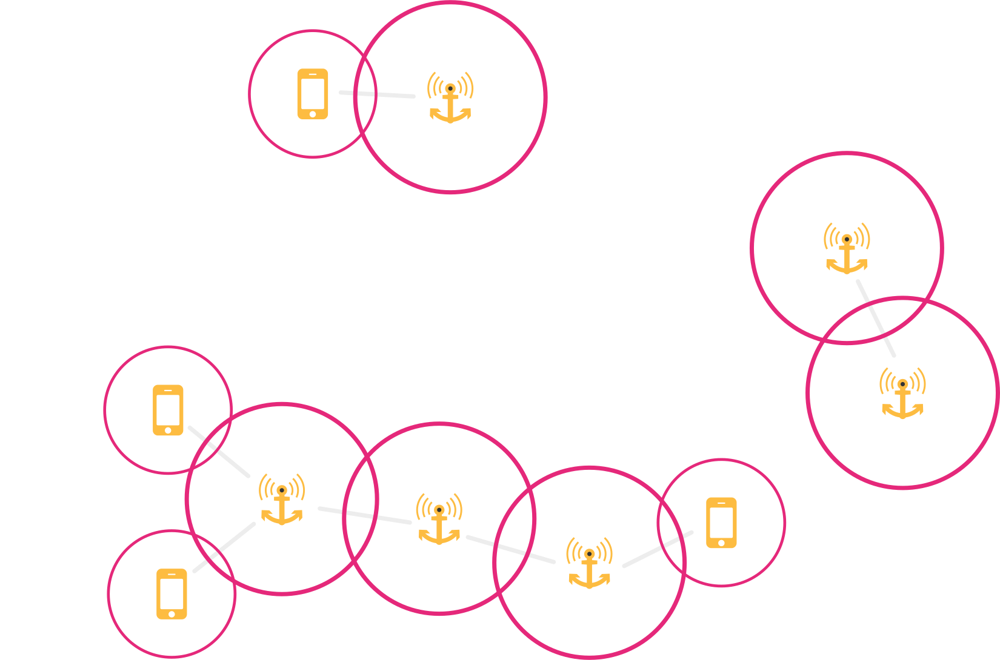

# Was ist Freifunk?

### Menschen mit Internet versorgen

### eigenes Netz aufbauen

* frei
* offen
* dezentral
* unabh&auml;ngig
* &Uuml;berwachungsfrei
* folgt dem "Picopeering Agreement"

# Technik

### Mesh
WLAN Verbindung zu weiteren Knoten

### VPN
* "St&ouml;rer" ist Freifunk
* verschl&uuml;sselt

# Mitmachen

#### komm zu den Treffen

* Montags ab 19Uhr beim CCCHH im Zeiseweg 9
* Freitags ab 19:30Uhr beim Attraktor e.V. im Eschelsweg 4
https://hamburg.freifunk.net/kalender

* Netzmaintanance
    * Server-Administration
    * Richtfunk
    * Firmware
* &Ouml;ffentlichkeitsarbeit
    * Vortr&auml;ge
    * Pressearbeit
    * Partnergewinnen
    * Gestaltung

### werde Teil des Netzes
* Router aufstellen
* Freunde &uuml;berzeugen
* Dienste anbieten

# Matrix.org
